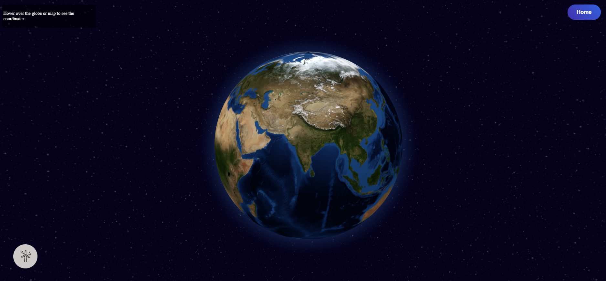
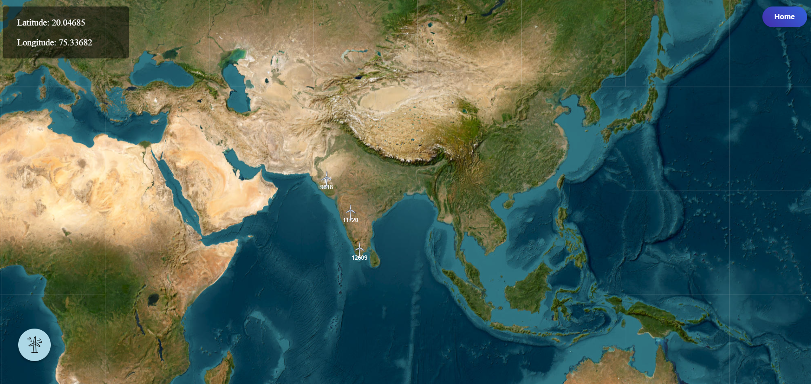
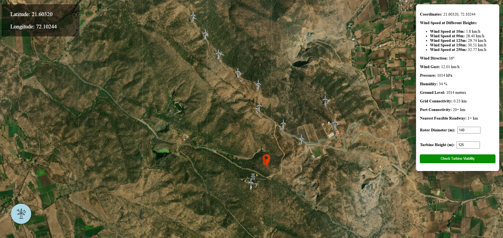
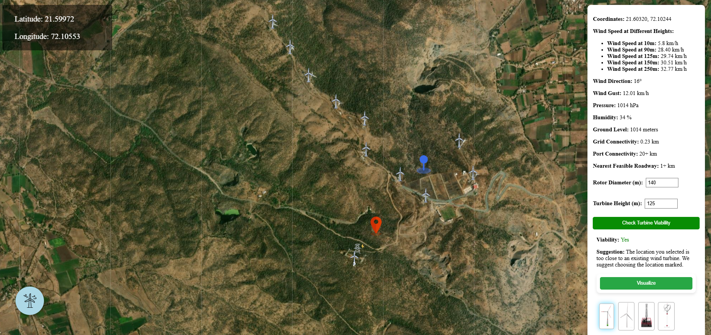
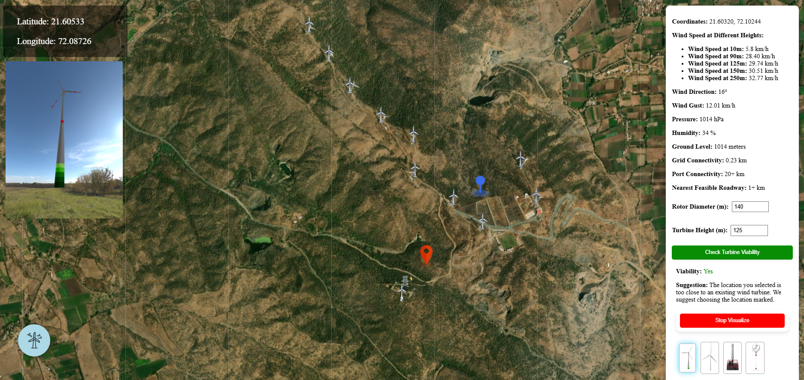

<!-- PROJECT TITLE -->
<div >
  <h1  style="bold"  >
    WindGrid-AI: An AI based optimal Wind Turbine Site Selection Tool
  </h1>
  
  <h3>
    Techgium 8th Edition. PID: TG08000490
  </h3>
  <hr>
</div>


## Why We Made WindGrid-AI
The selection of optimal locations for wind turbine installation is a complex process that involves analyzing multiple environmental, geographic, and meteorological factors. Traditional methods of site selection are time-consuming, expensive, and often rely on expert judgment. By leveraging AI and machine learning, we aim to automate and optimize this process, ensuring accurate predictions, reduced costs, and improved efficiency in wind energy generation. Our solution integrates data-driven insights to support sustainable energy development and maximize power output while minimizing environmental impact.

## Use
This AI-powered system enables users to assess the suitability of a location for wind turbine installation. After dropping a pin on the desired location, our tool provides key information about the location such as wind speed, land elevation, grid and port connectivity, distance of the nearest feasible roadway. Using predictive modeling and clustering techniques, it determines whether the location is viable for wind energy production. The tool is useful for researchers, policymakers, and energy companies looking to make informed decisions about setting up wind energy projects.

## Working
1. The application features an interactive 3D globe, allowing users to explore potential wind turbine locations. A dedicated button enables users to visualize existing wind turbine sites.
2. Upon zooming in, the 2D Map is displayed, providing a closer view for site selection.
3. Users can click on any desired location on the map to drop a pin, triggering a side panel on the right side of the screen. This panel presents key location-specific insights, including:
- Average Wind Speed
- Land Elevation
- Grid and Port Connectivity
- Distance to the Nearest Feasible Roadway
4. Additionally, users can manually input two crucial parameters: Rotor Diameter and Turbine Height. After entering these values, they can click the "Check Turbine Viability" button.
5. Once clicked, the AI-driven model processes the gathered data, analyzes all relevant parameters, and predicts whether the selected location is suitable for wind turbine installation.
6. To enhance visualization, users can also see a realistic rendering of how a wind turbine would appear at the chosen location.

## Project Overview

### Home Page- 


### Home Page 2- 


### Interactive 3D Globe- 


### 2D Map- 


### Dropping of Pin on the Desired Location- 


### On clicking the "Check Turbine Viability" button- 


### Rendering of Wind Turbine at the chosen location- 



## [Video Link](https://youtube.com)


## Technology Stack Used
<div class="flex ">
  


  
</div>

<br>

## How to Run

Follow these steps to set up and run WindGrid-AI locally:

1. **Clone the Repository:**

    ```bash
    git clone https://github.com/your-username/WindGrid-AI.git
    cd WindGrid-AI
    ```

2. **Install Dependencies:**

    ```bash
    # Install backend dependencies
    pip install -r requirements.txt

    # Install frontend dependencies
    npm install
    ```

3. **Run the Application:**

    ```bash
    # Run Python backend in Terminal 1
    cd backend
    python app.py

    # Run React frontend in Terminal 2
    cd frontend
    npm start
    ```

    The application will be accessible at `http://localhost:3000` by default.


## About Us
### Team Members 
1. [Suhaani Aggarwal](https://github.com/Suhaani07/)
2. [Aashish Bathe](https://github.com/AashishBathe/)
3. [Harsh Dharpawar](https://github.com/LighterBund/)
4. [Ananth Balvalli](https://github.com/ananthvgb2003/)

## Copyright